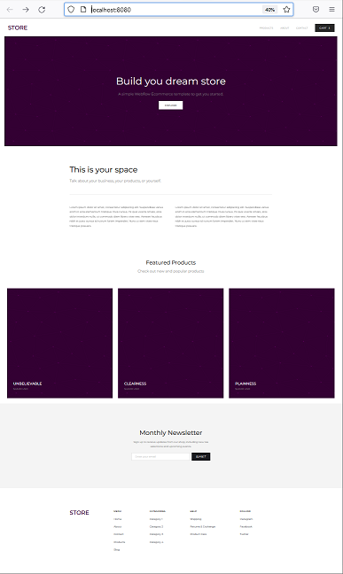
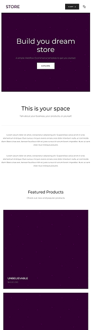
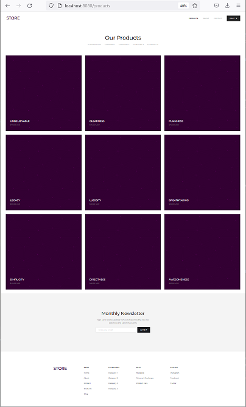
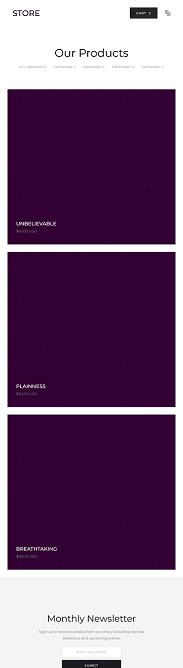
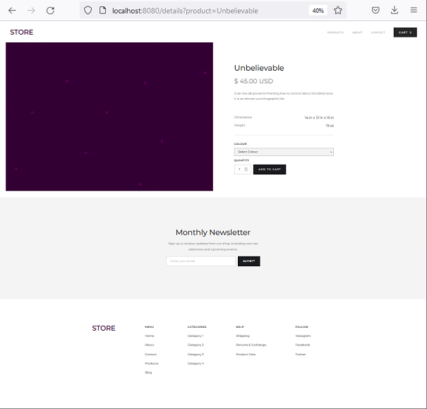
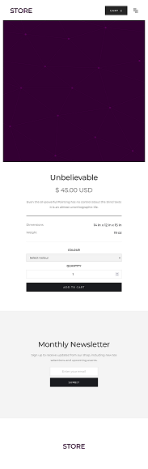
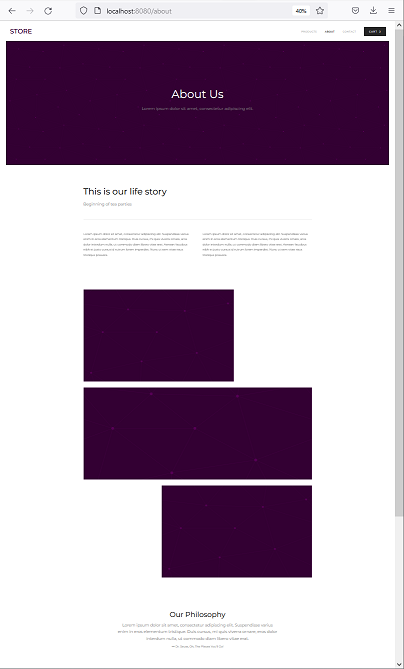
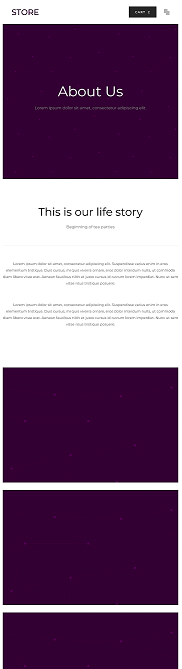
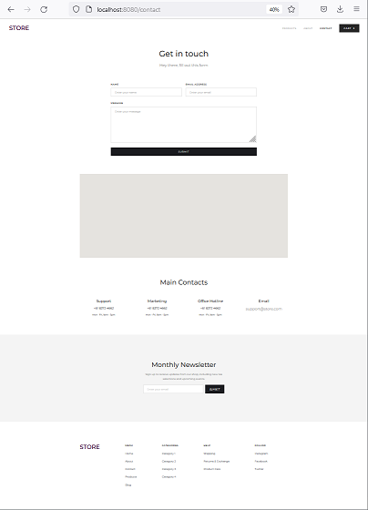
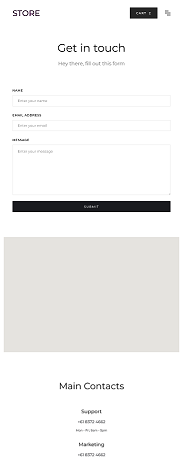

## Summary

The **Store Front Template** is an individually created, full-stack project made to solidify my understanding of several full-stack development principles. This project uses HTML, CSS, Javascript and the Fetch API to present an interactive UI for the user. Products and the shopping cart are stored on the back-end using MySQL, Java and Spring MVC. The idea for this project was drawn from a Webflow example located at: https://store-starter-template.webflow.io/

Github Page: https://github.com/MichaelKeithJones/shopping-servlet-java

## Technologies
- HTML, CSS, JavaScript, Fetch API
Front-End:

Back-End:
- MySql, Java, JavaServer Pages (JSP) / JavaServer Pages Standard Tag Library (JSTL), Servlets (javax)

## External Dependencies

- **Webflow**: https://store-starter-template.webflow.io/ - For the original idea and concept.

## Home

**The Home Page** for this application is where the user is introduced to th site. It provides a small space to describe the site and features a few of the stores feature items. 

Home View

    
    

<em>Desktop / Mobile</em>

## Products

**The Products Page** displays all available products on page load. Here a user can 'click' several links that will products by category. Upon clicking a product, the user will be sent to the product details page.

Products View

    
    

<em>Desktop / Mobile</em>

## Details

**The Details Page** displays the product details of a previously selected item. The item quantity and or color are selected and placed in the shopping cart when the "Add to Cart" button is clicked.

Details View

    
    

<em>Desktop / Mobile</em>

## About

**The About Page** provides a space for the user to tell a story about themselves. Here users, can speak on their people, display pictures of their company and state their business philosophy.

About View

    
    

<em>Desktop / Mobile</em>

## Contact

**The Contact Page** provides a form for the user to use to contact the site owner, if needed.

About View

    
    

<em>Desktop / Mobile</em>

## To Do

- Add in a 'User' model and add security.
- Add in a mail feature for the contact form.

